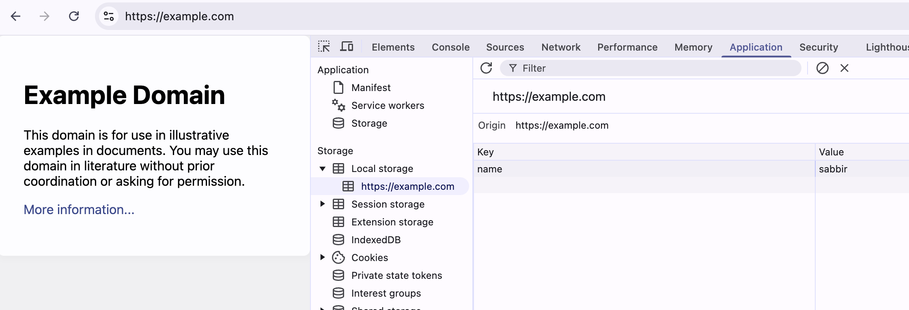

# Cookie  
A cookie is a small piece of data that a server sends to a user's web browser, which is stored on the user's device and sent back to the server with subsequent requests.  

Cookies are mainly used for three purposes:

- **Session management:** User sign-in status, shopping cart contents, game scores, or any other user session-related details that the server needs to remember.
- **Personalization:** User preferences such as display language and UI theme.
- **Tracking:** Recording and analyzing user behavior.  


<a href='https://developer.mozilla.org/en-US/docs/Web/HTTP/Cookies'> source: developer.mozila.cookies </a>

## Data storage  

## Local Storage vs Session Storage

| Feature | localStorage | sessionStorage |
|---------|------------|--------------|
| **Lifespan** | Data persists **even after the browser is closed**. | Data is **deleted when the tab or browser is closed**. |
| **Scope** | Shared across all tabs and windows from the same origin. | Only accessible in the tab where it was created. |
| **Storage Limit** | ~5MB per origin. | ~5MB per origin. |
| **Accessibility** | Accessible from any tab or window under the same origin. | Only accessible within the tab where it was created. |
| **Use Case** | Storing user preferences, themes, tokens, etc. | Temporary data like form inputs, session-based authentication, etc. |  

<br>

## Local Storage  


<br>
  

<br>

## Session Storage  


<br>
  

<br>

## IndexDB  
IndexedDB is a low-level, NoSQL database built into modern web browsers that allows websites to store large amounts of structured data locally on a user’s device. It is an alternative to traditional storage mechanisms like cookies, localStorage, and sessionStorage, offering more powerful capabilities.  

## Key Features of IndexedDB:
- **Stores Large Data** – Unlike cookies and localStorage, IndexedDB can handle gigabytes of data.
- **Asynchronous API** – Uses event-driven programming (via Promises or callbacks) to avoid blocking the main thread.
- **Supports Indexing** – Allows efficient searching and retrieval using indexes.
- **Object Storage** – Stores data as key-value pairs (objects), similar to NoSQL databases.
- **Transactions** – Ensures atomicity and consistency when modifying data.

<br>
  

## Scope of a cookie

The ```Domain``` and ```Path``` attributes define the scope of a cookie: what URLs the cookies are sent to.  

- If ```Domain``` is specified the cookie is available on that domain and its subdomains. For Example:  
if cookie is set from ```http://example.com``` it will also be availbale on ```http://www.example.com```  

- If the Set-Cookie header does not specify a Domain attribute, the cookies are available on the server that sets it but not on its subdomains.  

- A server can only set the Domain attribute to its **own domain** or a **parent domain**, not to a subdomain or some other domain. So, for example, a server with domain ```foo.example.com``` could set the attribute to ```example.com``` or ```foo.example.com```, but not ```bar.foo.example.com``` or ```elsewhere.com```

## Secure
A cookie with the ```Secure``` attribute is only sent to the server with an encrypted request over the HTTPS protocol. It's never sent with unsecured HTTP (except on localhost)