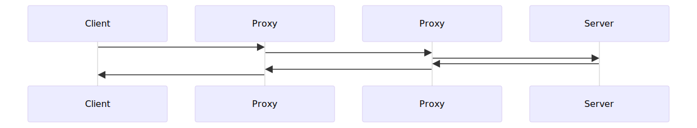

# HTTP (Hyper Text Transfar Protocol)

## What is HTTP
HTTP is a protocol for fetching resources such as HTML documents. It is the foundation of any data exchange on the Web.  
- A protocol is a system of rules that define how data is exchanged within or between computers. Communications between devices require that the devices agree on the format of the data that is being exchanged. The set of rules that defines a format is called a protocol.  

## **HTTP** is a client server protocol.  
A client-server protocol is a set of rules that govern communication between a client and a server over a network. The client requests services or resources, while the server processes those requests and responds accordingly.
### Why HTTP is a Client-Server Protocol
HTTP is a client-server protocol because it follows the client-server architecture, where:  
- **Client Requests:** A web browser (client) sends an HTTP request to a web server to fetch a webpage, image, or other resources.  

- **Server Response:** The web server processes the request and responds with the requested data, usually in HTML, JSON, or other formats.

- **Stateless Communication:** Each HTTP request is independent, meaning the server does not retain information about previous requests unless additional mechanisms like cookies or sessions are used.  

For example, when you type a URL into your browser:

- The browser (client) sends an HTTP request (e.g., GET /index.html).  

- The server processes this request and sends back the requested page (200 OK response with HTML content).  

- The browser renders the page for the user.  

Since HTTP follows this request-response model between a client and a server, it is classified as a client-server protocol.

## **HTTP** is an application layer protocol.  
An Application Layer Protocol is a set of rules that govern how software applications communicate over a network, providing services like web browsing, email, and file transfer.  

### Why is HTTP an Application Layer Protocol?

- **Handles End-User Communication** – HTTP enables users to access web pages by defining how requests and responses are exchanged between a client (browser) and a server.  
  *Example:* A browser sends an HTTP request to `example.com`, and the server responds with an HTML page.  
- **Defines Request and Response Rules** – HTTP standardizes how clients request resources and how servers respond (e.g., using `GET`, `POST`, `PUT`, `DELETE` methods).  
  *Example:* `GET /index.html` fetches a webpage, while `POST /login` submits user data.  
- **Relies on the Transport Layer (TCP/UDP)** – HTTP does not manage data transmission directly; instead, it relies on **TCP (Transmission Control Protocol)** at the **Transport Layer (Layer 4)** to ensure reliable delivery.  
  *Example:* TCP ensures all HTTP packets are received correctly, preventing missing or duplicate data.  
- **No Involvement in Data Transmission** – HTTP only structures and interprets data but does not handle packet routing, addressing, or network management (handled by lower OSI layers).  
  *Example:* HTTP requests are converted into TCP/IP packets by lower layers before transmission.  
- **Uses Human-Readable Data Formats** – HTTP communicates using **plain text, JSON, XML, and HTML**, which are designed for application-level interactions.  
  *Example:* A REST API returns JSON-formatted data over HTTP.  

## Components of HTTP-based systems  

Each individual HTTP request is sent to a server, which handles it and provides an answer called the response. Between the client and the server there are numerous entities, collectively called proxies, which perform different operations and act as gateways or caches. 

### Role of Proxies  
- Proxies sit between the client and server, performing different tasks:  
  - Forward Proxy: A forward proxy sits between the client and the internet. It processes client requests and forwards them to the destination server on behalf of the client. (VPN, filtering).  
  - Reverse Proxy: A reverse proxy sits in front of a web server, handling requests from clients before they reach the server (load balancing, security, chaching).  
- Requests may pass through multiple proxies before reaching the server, and responses follow the same route back.  

### Network Components Between Client and Server  
- Other hidden network devices include:  
  - Routers: Direct traffic across networks.  
  - Modems: Convert digital signals for internet transmission.  
  - Switches: Manage internal network traffic.  
- These devices operate at lower OSI layers (Network & Transport), while HTTP functions at the Application Layer.  

### HTTP at the Application Layer  
- HTTP focuses only on communication between the client and server.  
- It does not handle routing, addressing, or transmission, which are managed by lower layers (TCP/IP).  
